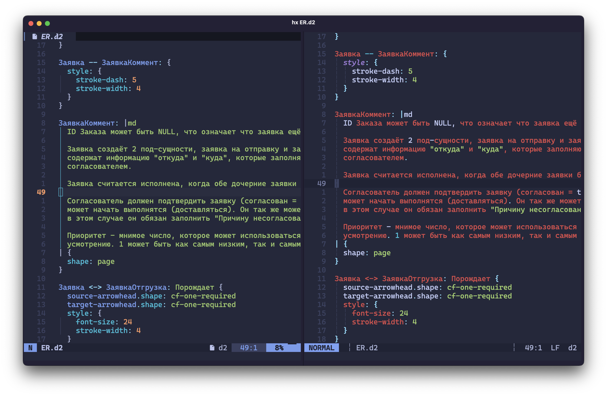

# tree-sitter-d2

[](https://github.com/ravsii/tree-sitter-d2/actions/workflows/build.yml)
[](https://github.com/ravsii/tree-sitter-d2/actions/workflows/test.yml)

## Table of Contents

<!--toc:start-->

- [tree-sitter-d2](#tree-sitter-d2)
  - [Table of Contents](#table-of-contents)
  - [Description](#description)
  - [Installation](#installation)
    - [Neovim](#neovim)
    - [Helix](#helix)
    - [Other editors](#other-editors)
  - [Showcase](#showcase)
  - [Comparison](#comparison)
    - [Better consistency overall](#better-consistency-overall)
    - [Better handling of foreign languages](#better-handling-of-foreign-languages)
    <!--toc:end-->

## Description

Tree Sitter grammar for [d2lang] \([github]\). It's not yet finished, but usable for
every-day cases with support for latest features like globs, filters and
variables.

The goal is to provide better experience for existing keywords, code blocks
injections, folds, etc.

- **Better parsing of modern structures** - The latest supported version of d2
  is **v0.6.8**.
- **Built with [nvim-treesitter] in mind** - We respect and follow its
  [highlight] groups.
- **Keywords** - _All_ keywords from the documentation are treated as such.
  (Open an issue if any are missing.)
- **Tests** - We aim to cover all edge cases and examples from the
  documentation, resulting in more robust parsing. Currently, we have more
  than 100 tests. (This will be reduced later when the grammar becomes stable.)

[highlight]: https://neovim.io/doc/user/treesitter.html#_treesitter-queries
[d2lang]: https://d2lang.com/
[github]: https://github.com/terrastruct/d2

---

_I've never done anything remotely close to parsing grammar, so there could be
some bad patterns and simply bad code. Feel free to open issues._

## Installation

### Neovim

1. Add this to your config, after installing [nvim-treesitter]

```lua
local parser_config = require("nvim-treesitter.parsers").get_parser_configs()
parser_config.d2 = {
  install_info = {
    url = "https://github.com/ravsii/tree-sitter-d2",
    files = { "src/parser.c" },
    branch = "main"
  },
  filetype = "d2",
}

-- we also need to tell neovim to use "d2" filetype on "*.d2" files, as well as
-- token comment.
-- ftplugin/autocmd is also an option.
vim.filetype.add({
  extension = {
    d2 = function()
      return "d2", function(bufnr)
        vim.bo[bufnr].commentstring = "# %s"
      end
    end,
  },
})
```

2. Do `:TSInstall d2`
3. Copy queries to one of your `rtp` paths. Usually `~/.config/nvim/` will do
   the job. You can check it using `:echo &rtp` command.

Example using `~/.config/nvim`

```text
~/.config/nvim/queries/d2
├── highlights.scm
├── injections.scm
└── locals.scm
```

Example using default [nvim-treesitter] dir with [lazy.nvim]

```text
~/.local/share/nvim/lazy/nvim-treesitter/queries/d2
├── highlights.scm
├── injections.scm
└── locals.scm
```

4. Check if `:TSModuleInfo` has `highlight` option enabled.

[lazy.nvim]: https://github.com/folke/lazy.nvim

### Helix

Fortunately Helix has it's own [guide] on how to add new languages and
grammars.

[guide]: https://docs.helix-editor.com/guides/adding_languages.html

A quick example for installing `d2` would be:

1. Add new language to `languages.toml`

```toml
[[language]]
name = "d2"
scope = "source.git"
file-types = ["d2"]
comment-token = "#"
roots = [""]
indent = { tab-width = 2, unit = "  " }

[[grammar]]
source = { git = "https://github.com/ravsii/tree-sitter-d2", rev = "main" }
name = "d2"

```

2. `hx --grammar fetch` && `hx --grammar build`
3. Add your queries to `~/.config/helix/runtime/queries/d2`

```text
~/.config/helix/runtime/queries/d2
├── highlights.scm
├── injections.scm
└── locals.scm
```

### Other editors

If you're using some other editor that's using tree-sitter, please open an
issue. Would be great if you could also provide instructions for other how to
install it.

[nvim-treesitter]: https://github.com/nvim-treesitter/nvim-treesitter

## Showcase

`Tokyo Night Storm` theme with `CaskaydiaCove` font.

_Props to Neovim's Tokyo Night theme for supporting pretty much every
[highlighting group]._

[highlighting group]: <https://neovim.io/doc/user/treesitter.html#_treesitter-queries:~:text=the%20exact%20definition)%3A-,%40variable,-various%20variable%20names>

<https://github.com/user-attachments/assets/a9bd20d0-eb6c-43c2-8e58-7d211d350025>

## Contribution

See [CONTRIBUTION.md](/CONTRIBUTING.md)

## Comparison

**This section is outdated and not maintained**

Actually, there's another [tree-sitter-d2] by pleshevskiy. My project's initial
goal was to fix issues his grammar had, but later I realized that his grammar
is not maintained and lacks many features `d2` has added since then.

Here's a list of comparisons as of `v0.2` version of this project, both using
`Tokyonight Storm` theme.

Please note that:

- On the left is our project using Neovim, on the right is pleshevskiy's
  grammar using [Helix] (I was unable to install pleshevskiy's grammar in Neovim)
- Some example are my random homework, thus being in Russian, please don't try
  make sense of them. Thanks! :D

[Helix]: https://helix-editor.com/
[tree-sitter-d2]: https://github.com/pleshevskiy/tree-sitter-d2

### Better consistency overall


### Better handling of foreign languages



